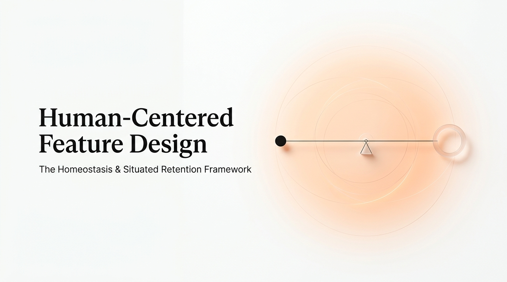

<div align="center">
  
</div>

<p align="right">
  <b>English</b> &nbsp;•&nbsp; <a href="docs/README_zh.md">中文</a>
</p>

<div align="center">
  <h3>Human-Centered Feature Design</h3>
</div>


> *"Humans are not variables of products; products are variables of humans. Needs arise from deviations from balance; products cannot manufacture desire, only serve as vehicles to restore equilibrium."*

**Human-Centered Feature Design** is a situated reasoning framework designed to **restore human balance, not manufacture motivation**. It tests and refines product solutions—from macro feature contracts down to micro interaction state boundaries—ensuring every design genuinely fulfills authentic user needs rather than team vanity or synthetic stickiness.

---

## When to Use

Any product feature ultimately comes down to two dimensional decisions: what data to present to the user, and how the user interacts with that data. When facing an ambiguous feature requirement, invoke this Skill to answer two core questions:

1. **Data (The "What")**: Stripping away vanity metrics and pseudo-needs, what data should the frontend actually display to reduce decision friction?
2. **Interaction (The "How")**: Breaking away from rigid machine logic, what state boundaries actually align with human flow and intuition?

Here is how the Skill reasons in real-world commercial scenarios (see `examples/` for full retrospectives):

### Case 01: Data Restraint (Topic Cards)
> **Scenario**: Designing a "Daily Topic" card feed to motivate users to practice speaking.
>
> **Before**:
> The system passed raw data directly to the frontend. Cards displayed statistical metrics with weak relevance to the user's current task (e.g., `46 pops`, `+12 more moments`), alongside flattened, scattered text from the user's past inputs. Without limits on information hierarchy, the interface generated significant cognitive redundancy.
>
> **After**:
> **1. Diagnosis**: The original data stream failed to help users form concrete action expectations.
> **2. Data Convergence**: Removed global statistical metrics and restructured the underlying data.
> **Final Presentation**: Aggregated the user's historical activities (Activity). Replaced global click counts with personal progress states (e.g., "never talked", "practiced 3 days ago"), transforming static system inventory into a personalized "digestive debt" list.

### Case 02: Interaction Empathy (Card Expand/Collapse)
> **Scenario**: In a reading feed, tapping a card expands it to show the full text. Product requirement: "Automatically collapse the card when the user leaves the current content."
>
> **Before**:
> The logic equated "leaving content" directly with "leaving the current page (Tab)." When scrolling vertically within the list, the system did not trigger auto-collapse, reasoning that users might notice a state change upon scrolling back. As users expanded multiple cards, the list lengthened continually, and the screen remained occupied by already-read information.
>
> **After**:
> **1. State Analysis**: Deduced that "expanded" is not a persistent data attribute of the card, but a localized, temporary state of user focus.
> **2. Defining Boundaries**: Based on the lifecycle of this state, the rules were divided into three contextual boundaries:
>    - *Local interactions within the viewport (e.g., keyboard rising)* ➔ **Maintain expanded state; do not intervene.**
>    - *Card completely slides out of the visible area* ➔ **Silently collapse off-screen with no animation transition.** When the user scrolls back, the interface has returned to its clean default list structure.
>    - *Switching pages or Tabs* ➔ **Trigger global state reset.**

---

## Install

This is a concise, self-contained skill. You can integrate it in three simple ways:

### 1. Manual
Download [`SKILL.md`](SKILL.md) and upload it to Claude.ai Project Knowledge, Cursor/Windsurf rules (`.cursorrules`), or directly into any AI conversation.

### 2. Install to Shared Skills Directory
Clone directly into your local coding agent's shared skills path:
```bash
git clone https://github.com/LillyLiuJun/human-centered-feature-design.git ~/.config/skills/human-centered-feature-design
```

### 3. Let Your Agent Install It
Send this prompt to your coding agent:
```text
Install and enable this skill in my environment: https://github.com/LillyLiuJun/human-centered-feature-design
```

---

## Philosophy

All situated deductions in this framework operate on a single axiom: **products are vehicles to restore human balance, not engines to exploit human attention.**

```
Human in Disequilibrium ──► Product as Quiet Relief Valve ──► Balance Restored · Sovereign Agency Felt
```

This philosophy translates into three operational pillars:

1. **Homeostasis over Synthetic Motivation**: Needs stem from natural deviations from psychological or physical equilibrium. Products cannot manufacture organic desire; they serve as frictionless outlets for discrete resolution or continuous momentum (managing digestive debt rather than piling static inventory).
2. **Sovereign Agency over Coercive Mechanics**: Humans crave mastery. The system scaffolds invisibly across the six cognitive touchpoints (perception, search, decision, action, evaluation, and habit), always crediting the human rather than algorithmic wizardry. **Great systems are quiet.**
3. **Situated Context over Mechanical Triggers**: Products only borrow influence when they precisely fit the user's spatial constraints, biological rhythms, and cognitive margins. Eliminate unprompted notification spam by diagnosing the true behavioral gap (FBM).

### The Three Litmus Tests
Before shipping any feature or interaction, audit it against three final filters:
* **Does this return the human to balance, or manufacture synthetic anxiety?**
* **Does the user feel sovereign agency, or are they being piloted by system mechanics?**
* **Does this embed seamlessly into authentic lived context, or create tone-deaf noise?**

---

## License

Released under the [MIT License](LICENSE).

